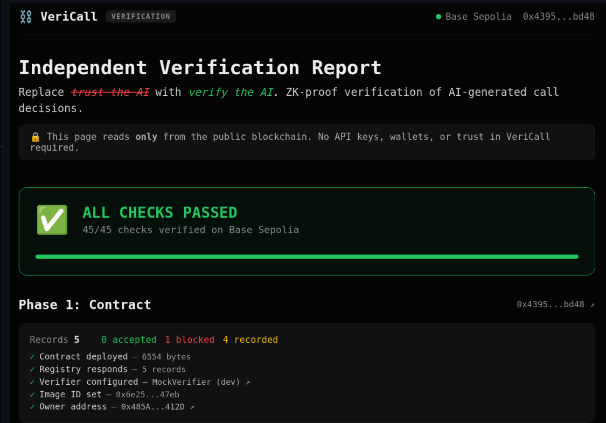
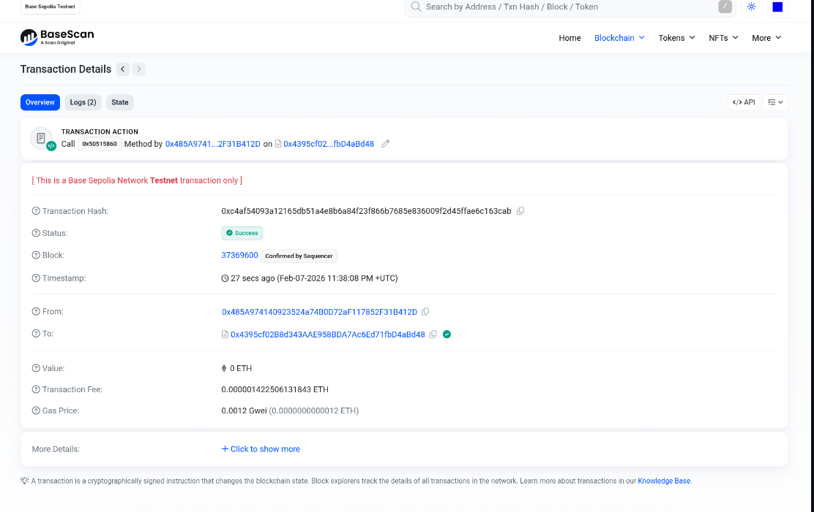
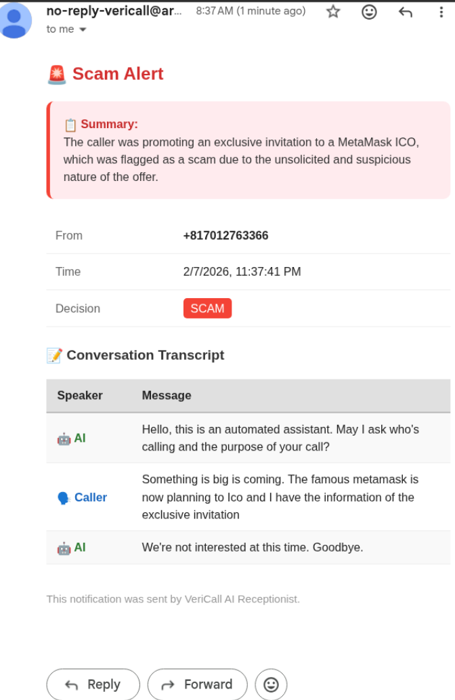
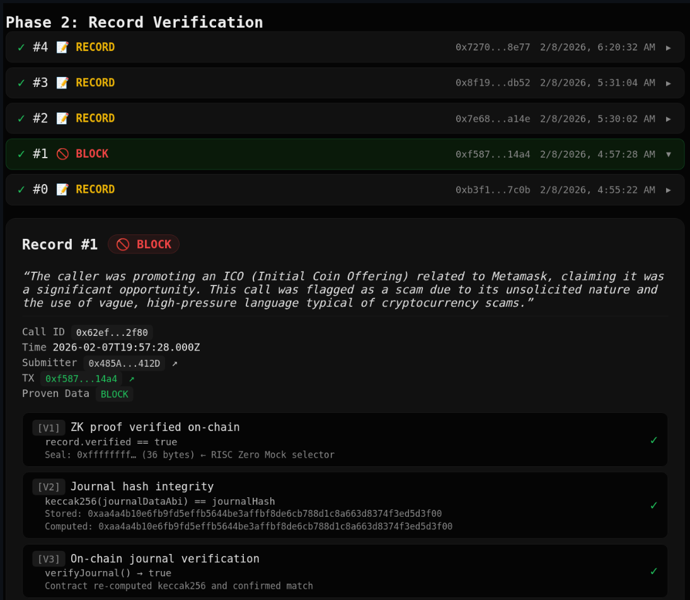

# ☎️ VeriCall

<p align="left">
  <a href="https://vericall-kkz6k4jema-uc.a.run.app/demo">
    
  </a>
  &nbsp;
  <a href="https://vericall-kkz6k4jema-uc.a.run.app/verify">
    
  </a>
</p>


**Hello! HackMoney 2026! but money is *already* being hacked**

**— by Scam Phone Call, $16 B in 2024 alone (FBI IC3).**

**We built a AI wall for protecting that Money. A "Mathematical Gatekeeper"**

**— Protecting Your Family from AI Scams with Verifiable Trust**


AI decision non-repudiation + public accountability, anchored on-chain.


## 📞 The Problem

Phone calls remain one of the most universal communication tools — used across all generations, from grandparents to business professionals. But **trust in phone calls is quietly eroding**.

Spam, robocalls, and impersonation fraud have made people hesitant to pick up unknown numbers. And now, AI voice synthesis is lowering the barrier further — making it possible to fake a familiar voice from a short sample.

- 🇺🇸 **"Grandparent Scams"** — USA: phone fraud costs billions annually
- 🇪🇺 **"Impersonation Scams"** — Europe: AI-generated voice fraud is emerging
- 🇯🇵 **"It's me Scam (OreOre オレオレ詐欺)"** — Japan: a decades-old problem now amplified by voice AI

The phone itself is not the problem — **the lack of verifiable trust is**. When you can't confirm who's really calling or what really happened on a call, the phone becomes less useful for everyone.

## 🛡️ The Solution: A Mathematical Gatekeeper

VeriCall puts a wall of logic — without emotions — in front of every call. The AI answers first, screens with fixed rules, seals the decision on-chain, and **nobody can rewrite the story afterward**.

📞 Call → 🤖 AI → ⚖️ Decision → 🔐 TLSNotary → 🧮 ZK Proof → ⛓️ On-Chain

### Step 1: 🤖 AI Screens the Call

A real phone call comes in via Twilio. The AI (Gemini 2.5 Flash) answers before it reaches your family — no emotions, no exceptions. Even if a scammer cries, screams, or fabricates an emergency, the AI stays calm and checks **facts** and **identity** using **fixed screening rules** embedded in [public source code](https://github.com/rtree/veriCall). It decides: **BLOCK** (spam alert sent to you) or **RECORD** (call connected or email notification).

### Step 2: 🔐 Web Proof (TLSNotary)

[vlayer](https://vlayer.xyz)'s Web Prover fetches the Decision API response using TLSNotary — a third-party Notary joins the TLS session via MPC, never sees the plaintext, but cryptographically attests that VeriCall's server genuinely returned this JSON. The response contains decision **Input**, **Output**, and **Logic** (source code commit) — all attested in a single proof.

### Step 3: 🧮 ZK Proof (RISC Zero)

vlayer's ZK Prover compresses the Web Proof into a succinct RISC Zero proof. JMESPath extraction pulls 5 fields — `decision`, `reason`, `systemPromptHash`, `transcriptHash`, `sourceCodeCommit` — into a 10-field ABI-encoded journal. Input + Output + Logic are sealed together.

### Step 4: ⛓️ On-Chain Record

The proof and journal are submitted to `VeriCallRegistry` on Base Sepolia. The contract validates **every field** before storing — 15 on-chain checks including **Decision–Journal Binding** (💡 core technical contribution: the submitted decision must `keccak256`-match the proven decision — you can't submit a valid proof with "RECORD" and store "BLOCK"). → [Full contract checks](DESIGN.md#37-on-chain-verification--contract-design)

> 🔍 **You don't need to take VeriCall's word for it.** Every on-chain record — decision, reasoning, ruleset hash, transcript hash, source code commit — is publicly readable. Verify [from your browser](https://vericall-kkz6k4jema-uc.a.run.app/verify) or [from the CLI](scripts/verify.ts). No API keys, no VeriCall servers required.

## Architecture

```
                              💻 GitHub (Public Repository)
                              github.com/rtree/veriCall
                              ┌─────────────────────────────┐
                              │ gemini.ts    → screening rules│
                              │ decision-store.ts → hashing  │
                              │ route.ts     → API response  │
                              └──────────────┬──────────────┘
                                             │ git commit SHA
                                             │ embedded at build time
                                             ▼
  📞 Caller ──→ Twilio ──→ WebSocket ──→ VeriCall Server (Cloud Run)
                                              │
                              ┌────────────────┴────────────────┐
                              │         Audio Pipeline          │
                              │    STT ──→ Gemini ──→ TTS      │
                              │              │                  │
                              │          Decision               │
                              │       (BLOCK / RECORD)          │
                              └────────────────┬────────────────┘
                                               │
                    ┌──────────────────────────┤
                    │                          │
                    ▼                          ▼
           📧 Email Notify          Decision API (HTTPS)
                                    ┌─────────────────────────┐
                                    │ decision     (Output)   │
                                    │ reason       (Output)   │
                                    │ transcriptHash (Input)  │
                                    │ promptHash   (Logic)    │
                                    │ commitSHA    (Logic) ───┼──→ GitHub Attestation:
                                    └────────────┬────────────┘    commit links to
                                                 │                 auditable public code
                                    TLSNotary attests entire
                                    response in single proof
                                                 │
                                                 ▼
                                      vlayer Web Prover
                                        (TLSNotary)
                                                 │
                                                 ▼
                                      vlayer ZK Prover
                                        (RISC Zero)
                                    Seals Input + Output + Logic
                                    into 10-field ABI journal
                                                 │
                                                 ▼
                                        Base Sepolia
                                      VeriCallRegistry
                                    15 on-chain validations
                                                 │
                                                 ▼
                                         🔍 Anyone
                                    verifies on-chain via /verify
                                    + reads Logic on GitHub at
                                      proven commit
```

## What Gets Proven — Non-Repudiation Through ZK

Every call produces a ZK proof containing these journal fields. Once on-chain, the operator **cannot** alter, deny, or selectively disclose any of them.

| Part | What's Non-Repudiable | ZK Journal Parameter | Mechanism |
|---|---|---|---|
| **Input** | **Conversation** | `provenTranscriptHash` (SHA-256) | TLSNotary attests server response → ZK extracts → contract requires non-empty. Locks which conversation produced this decision. |
| **Input** | **When it happened** | `timestamp` | TLS session timestamp — set by TLSNotary during MPC, not by the server. Cannot be forged by client or server. |
| **Output** | **Decision** | `provenDecision` (`BLOCK` / `RECORD`) | TLSNotary attests server response → ZK extracts → contract binds via `keccak256` match |
| **Output** | **Reasoning** | `provenReason` (full text) | TLSNotary attests server response → ZK extracts → contract binds via `keccak256` match |
| **Logic** | **Screening rules** | `provenSystemPromptHash` (SHA-256) | TLSNotary attests server response → ZK extracts → contract requires non-empty. Read the [source code](lib/voice-ai/gemini.ts#L124) at the proven commit → hash → compare. |
| **Logic** | **Source code ** | `provenSourceCodeCommit` (git SHA) | TLSNotary attests server response → ZK extracts → contract requires non-empty. [Inspect on GitHub](https://github.com/rtree/veriCall). |
| | **Privacy** | | Phone numbers never go on-chain. Transcript is hashed. Reasoning is plaintext — intentional, because accountability requires public auditability. |

### 🔗 How Logic Gets Proven — GitHub Code Attestation

The table shows *what* is non-repudiable. Here's *how* the Logic fields get locked:

1. At **build time**, the server captures its git commit (`git rev-parse HEAD`)
2. The **Decision API(of VeriCall)** embeds the commit SHA + system prompt hash in every JSON response
3. **TLSNotary(of vlayer)** attests the entire response is coming from Decision API(of VeriCall) and ZKProver(of vlayer) packs them in a single proof — decision, hashes, AND commit SHA
4. The **contract** stores `provenSourceCodeCommit` and `provenSystemPromptHash` on-chain (enforces non-empty)
5. **Anyone** can inspect the exact code at [`github.com/rtree/veriCall/tree/<commit>`](https://github.com/rtree/veriCall) — read the [screening rules](lib/voice-ai/gemini.ts#L124), recompute the prompt hash, and compare. If it doesn't match → **the server lied about its commit**

## Trust Model

The table above shows that **Input, Logic, and Output are all non-repudiable**:

- ✅ **Input** — `transcriptHash` seals which conversation was evaluated
- ✅ **Output** — `decision` and `reason` are bound via `keccak256` — inseparable from the proof
- ✅ **Logic** — `sourceCodeCommit` points to [public code on GitHub](https://github.com/rtree/veriCall). Anyone can read the [AI rules](lib/voice-ai/gemini.ts#L124), the [hash computation](lib/witness/decision-store.ts#L46), and the [API response format](app/api/witness/decision/%5BcallSid%5D/route.ts#L30) at the proven commit. If on-chain hashes don't match → **the server lied about its commit**.

**What remains — two honest gaps:**

| Gap | What It Means | How It Gets Closed |
|-----|---------------|--------------------|
| **Binary ≠ Commit** | The deployed binary might not exactly match the proven commit | Reproducible builds or TEE — if the binary differs, behavior diverges from public code (a detectable inconsistency) |
| **AI Inference** | TLSNotary proves what the *server returned*, not what the *model computed* internally | Google Vertex AI API attestation or TEE — proving the model itself returned this output |

```
  Trust Evolution:

  Today (no VeriCall)         VeriCall (now)                   Future
  ┌──────────────────┐        ┌──────────────────────────┐     ┌──────────────────────────┐
  │ Trust the         │        │ Trust server attestation  │     │ Trust Google API          │
  │ operator entirely │ ──→    │ + chain immutability      │ ──→ │ attestation + TEE         │
  │                   │        │ + auditable source code   │     │ (full inference proof)    │
  │ "Just trust us"   │        │ "Operator can't rewrite   │     │ "Even the server can't    │
  │                   │        │  history"                 │     │  lie about AI output"     │
  └──────────────────┘        └──────────────────────────┘     └──────────────────────────┘
```

## Try It Yourself

### 📞 Live Demo

Open **[/demo](https://vericall-kkz6k4jema-uc.a.run.app/demo)** — call the number shown and watch the full pipeline in real-time:

📞 Call → 🤖 AI → ⚖️ Decision → 🔐 WebProof → 🧮 ZK → ⛓️ On-Chain

### 🔍 Verify Records

Open **[/verify](https://vericall-kkz6k4jema-uc.a.run.app/verify)** — runs 14+ automated checks per record, entirely client-side. No wallet, no API keys.



```bash
npx tsx scripts/verify.ts          # verify all on-chain records
npx tsx scripts/verify.ts --deep   # also re-fetch Decision API for live check
```

## Beyond Phone Calls

This pattern — **committing an AI decision, its inputs, and its rules to an immutable on-chain record** — applies to any AI decision system:

| Domain | What's Verified |
|--------|------------------|
| 📞 Call Screening | AI classification committed on-chain |
| 📄 Resume Screening | AI evaluation committed on-chain |
| 🏦 Loan Decisions | AI assessment committed on-chain |
| 🛡️ Content Moderation | AI moderation committed on-chain |
| ⚖️ Insurance Claims | AI claim decision committed on-chain |

The proof pipeline is domain-agnostic; only the screening rules change.

## Tech Stack

| Layer | Technology |
|-------|------------|
| **Phone** | Twilio Programmable Voice + Media Streams |
| **AI** | Vertex AI Gemini 2.5 Flash |
| **STT / TTS** | Google Cloud Speech / Text-to-Speech |
| **Server** | Next.js 16 + custom WebSocket server on Cloud Run |
| **Database** | Cloud SQL (PostgreSQL 15) · IAM auth — stores decisions for Web Prover access |
| **Email** | SendGrid |
| **Logic Transparency** | [GitHub public repository](https://github.com/rtree/veriCall) — `sourceCodeCommit` embedded at build time, auditable by anyone |
| **Web Proofs** | vlayer Web Prover (TLSNotary / MPC) |
| **ZK Proofs** | vlayer ZK Prover (RISC Zero) |
| **Chain** | Base Sepolia · viem · VeriCallRegistry (Solidity / Foundry) |
| **CI/CD** | GitHub Actions · Workload Identity Federation · `git rev-parse HEAD` → build arg |

→ [Getting started & deployment](docs/DEPLOY.md) · [Full project structure & design](DESIGN.md)

## Status & Roadmap

**✅ Working today** — the full pipeline is live and verifiable:

- Real phone call → AI screening (Gemini 2.5 Flash) → BLOCK / RECORD decision
- TLSNotary Web Proof → RISC Zero ZK Proof → 10-field journal with Input + Output + Logic
- On-chain validation (15 checks, Decision–Journal Binding) on Base Sepolia
- `sourceCodeCommit` on-chain → [public GitHub repo](https://github.com/rtree/veriCall) → anyone audits the Logic
- Independent verification via [browser](https://vericall-kkz6k4jema-uc.a.run.app/verify) and [CLI](scripts/verify.ts) — no API keys, no VeriCall servers

**🔮 Closing the Trust Gaps** — from the [Trust Model](#trust-model):

| Gap | Solution | Effect |
|-----|----------|--------|
| **ZK Seal Verification** | vlayer production Groth16 proofs (upstream) | Currently `MockVerifier` — all other 14 checks are real. Swap to `RiscZeroVerifierRouter` with zero code changes → [Details](DESIGN.md#39-verifier-honesty-mockverifier-vs-production) |
| **Binary ≠ Commit** | TEE (Confidential Computing) or reproducible builds | Proves the running binary matches the proven commit — Logic becomes fully trustless |
| **AI Inference** | Google Vertex AI API attestation or TEE | Proves the model itself returned this output — not just the server |

When all three close → **Input, Output, AND Logic are mathematically proven end-to-end** (see Trust Evolution diagram above).

**🏛️ Who Writes the Rules?** — today it's a single operator. On-chain `systemPromptHash` opens the door:

| Model | How It Works |
|-------|--------------|
| **DAO Governance** | Token holders vote on screening rule updates — every version is auditable, no single operator can silently change logic |
| **Public Authority** | Telecom regulators / consumer protection agencies publish certified rulesets — operators prove compliance via `systemPromptHash` match |
| **Prediction Markets** | Stake on whether a rule change improves scam detection — market incentives replace committee debates |

## AI Attribution

This project was built with AI assistance (GitHub Copilot / Claude). Per ETHGlobal rules, here is how AI was used:

| Area | How AI Was Used |
|------|-----------------|
| **Architecture & Research** | SDK documentation lookup (vlayer, RISC Zero, TLSNotary), API design patterns, ZK proof pipeline exploration |
| **Documentation** | Human concept + core document → detailed technical writing (README, DESIGN.md, inline comments) |
| **Code Generation** | Human concept + core code → implementation (Solidity contracts, witness pipeline, verification CLI, web pages) |
| **Debugging** | Log analysis, error diagnosis, Gemini output format investigation |

All architectural decisions, system design, and verification logic were human-directed. AI accelerated implementation and documentation — it did not independently design the proof pipeline or contract validation.

<details>
<summary><strong>More Screenshots</strong></summary>

**On-Chain Transaction (BaseScan)**



**Email Notification (Scam Alert)**



**Verification Record Detail (V1–V3 checks)**



</details>

## License

MIT
